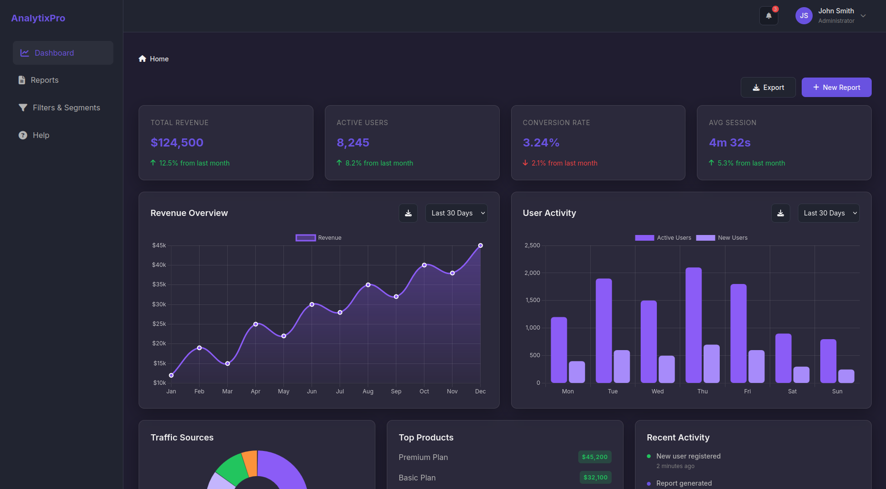
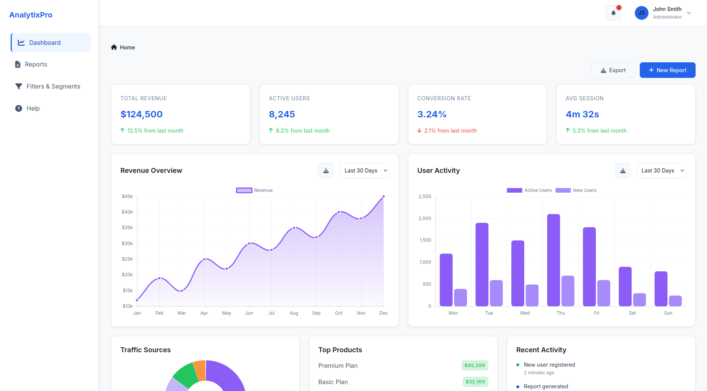

<div align="center">

<h1>AnalytixPro - Business Analytics Dashboard Template</h1>

  

<br>

<h3>Professional, Clean, & Interactive Business Analytics Dashboard</h3>
<p><i>A modern, vanilla HTML/CSS/JS template crafted for performance and clarity.</i></p>
</div>

<div align="center">

[](https://business-analytics-template.vercel.app)

</div>

<div align="center" style="display: flex; gap: 10px;">
    
    
</div>

---

## 🌟 Overview

**AnalytixPro** is a premium-quality business analytics dashboard template built entirely with **Vanilla HTML, CSS, and JavaScript**. It delivers a sleek, responsive, and professional interface without the bloat of heavy frameworks like React or Vue.

**Perfect for:**
- 📈 Analytics & Reporting Dashboards
- 🛍️ E-commerce Admin Panels
- 👥 User & Segmentation Management
- 💼 SAAS Application Starters

---

## 🚀 Key Features

*   **⚡ Zero Dependencies:** Built with pure Vanilla JS & CSS. Blazing fast performance.
*   **🎨 Dynamic Theming:** Persistent **Light Mode** & **Dark Mode** support.
*   **📱 Fully Responsive:** Adaptive layout with smooth mobile sidebar toggle.
*   **📊 Interactive Charts:** Integrated **Chart.js** with theme-aware color adaptation.
*   **📂 Structured Architecture:** Professional, modular file organization (`pages/`, `layouts/`, `assets/`).
*   **🔍 Power Tables:** Built-in Sorting, Pagination, and Advanced Filtering.
*   **🔔 Smart Notifications:** Integrated Toast notification system.

---

## 📂 Project Structure

Organized for scalability and ease of maintenance:

### 📄 Pages (`/pages`)
Core application pages categorized by function:

| Directory | File | Description |
|-----------|------|-------------|
| **`dashboard/`** | `index.html` | **Main Dashboard**. KPI cards, revenue analytics, and activity feeds. |
| | `settings.html` | Application settings including **Theme, Profile, & API Keys**. |
| **`reports/`** | `index.html` | **Transaction List**. Full-featured data table with export options. |
| | `generate.html` | Creation form with input validation. |
| | `view.html` | Detailed view for individual transactions/reports. |
| **`segments/`** | `index.html` | **Segmentation Tool**. Advanced filtering interface. |
| | `create.html` | Wizard for creating new user segments. |
| | `edit.html` | Edit interface for existing segments. |
| **`user/`** | `profile.html` | User profile management. |
| | `help.html` | Help center / FAQ with accordion navigation. |
| **`auth/`** | `login.html` | Responsive login page. |
| | `register.html` | New account registration page. |

### 🛠️ Layouts & Scripts (`/layouts`, `/css`, `/js`)
Core logic and reusable components:

| File | Description |
|------|-------------|
| **`css/style.css`** | **Master Stylesheet**. CSS variables, grid layouts, and component styles. |
| **`js/main.js`** | Global utilities (Toast notifications, formatters). |
| **`js/theme.js`** | **Dark/Light Mode** logic with `localStorage` persistence. |
| **`js/charts.js`** | **Chart.js** config. Handles dynamic coloring based on active theme. |
| **`js/datatable.js`** | Core logic for Table Sorting, Pagination, and Filtering. |
| **`js/data.js`** | Mock data generator & Export handlers (CSV/Excel). |
| **`js/header.js`** | Header interactions (Profile dropdown, Notifications). |
| **`layouts/header.html`** | Reusable header component reference. |

---

## 🔧 Getting Started

1.  **Clone or Download** the project.
2.  Open the root `index.html` in your web browser.
3.  You will be automatically redirected to the **Dashboard** (`pages/dashboard/index.html`).
4.  **Explore:**
    *   **Toggle Theme:** Go to Settings to switch between Dark & Light modes.
    *   **Analyze:** Sort columns or page through data in the Reports section.
    *   **Export:** Try the export functionality to download CSV/Excel reports.

---

## 💡 Customization Guide

### 🎨 Changing the Theme Colors
Modify the root CSS variables in `css/style.css` to match your brand:
```css
:root {
  --color-primary: #2563eb; /* Your Brand Color */
  --bg-primary: #ffffff;    /* Light Background */
  /* ... */
}
```

### 💾 Switching to Real Data
Update `js/data.js` to replace the mock data with your API response:
```javascript
// js/data.js
const sampleTransactions = [
  // Fetch from your API instead
];
```

---

*Crafted with precision for elegant business solutions.*
